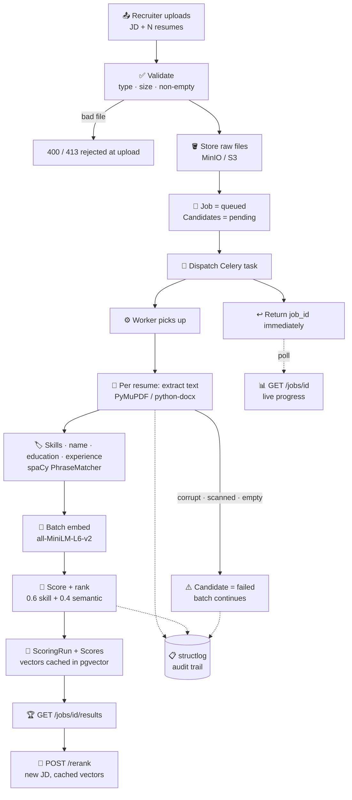

<div align="center">


<br/>

<p align="center">
  
  
  
  
  
</p>

<p align="center">
  
  
  
  
  
</p>

<p align="center">
  
  &nbsp;
  
  &nbsp;
  
  &nbsp;
  
</p>

<br/>

<h3>🔍 Two-Layer Scoring &nbsp;·&nbsp; ⚡ Async Workers &nbsp;·&nbsp; 🧬 Cached Embeddings &nbsp;·&nbsp; 🛡️ Failure Isolation</h3>

<br/>

</div>

---

## 💡 What is this?

> **A recruiter with 200 resumes and one afternoon does not need a number. They need to know *why* that number.**

This is a decision-support tool, not a filter. It takes one job description and many resumes, then ranks every candidate with **two independent signals** and shows the working: which required skills they have, which they are missing, and how much of the score came from each layer.

<table>
<tr>
<td width="50%" valign="top">

<b>Keyword-only screening</b> ❌

<ul>
<li>Misses "built REST services in Django" for a JD asking for backend frameworks</li>
<li>A resume stuffed with the JD's words wins</li>
<li>Recruiter sees a score with no reasoning</li>
</ul>

</td>
<td width="50%" valign="top">

<b>This system</b> ✅

<ul>
<li>Keyword layer catches hard requirements</li>
<li>Semantic layer catches paraphrased experience</li>
<li>Every score ships with matched and missing skills</li>
<li>A corrupt file fails alone — the batch still ranks</li>
</ul>

</td>
</tr>
</table>

---

## 🎬 The 60-second version

```bash
docker compose up -d --build       # postgres · redis · minio · api · worker · frontend
python scripts/seed.py --submit    # generates 5 sample resumes + 1 deliberately corrupt, screens them
```

```
POST /jobs (6 files) -> queued in 0.36s
finished in 2.33s -> completed  5 ok, 1 failed

#  Candidate        Final  Skill  Semantic   Matched
1  Priya Sharma     76.88  81.25     70.31   AWS, Celery, Distributed Systems
2  Sara Khan        48.95  43.75     56.75   AWS, Docker, Machine Learning
3  Arjun Mehta      42.11  25.00     67.78   Docker, PostgreSQL, Python
4  Deepak Nair      34.26  25.00     48.15   AWS, Docker, Kubernetes
5  Ravi Kumar       21.42   0.00     53.55   —

FAILED  corrupt_resume.pdf: Could not read PDF: Failed to open stream
```

**Look at rows 2 and 3.** Arjun's *semantic* score is higher — his resume reads like the JD. Sara's *skill* score is higher — she actually has more of the listed technologies. The weighted combination puts Sara ahead. Neither layer alone gets that ordering right, which is the entire argument for having both.

Open **http://localhost:3000** and try the same resumes against a Frontend JD — Ravi goes from last to first.

---

## 🔄 How a job actually flows



The worker **commits after every resume**, so `processed_resumes / total_resumes` climbs while the batch runs rather than jumping at the end. There is a test that fails if that commit ever moves outside the loop.

---

## 📐 The scoring engine

```
skill_score    = |matched_skills| / |required_skills|              # keyword layer
semantic_score = cosine(jd_embedding, resume_embedding)            # context layer
final_score    = W_SKILL × skill_score + W_SEMANTIC × semantic_score
```

Weights come from the environment (`W_SKILL=0.6`, `W_SEMANTIC=0.4`) and are validated to sum to 1.0 **at startup** — a typo fails the boot, not the ranking. Scores are reported 0–100.

<div align="center">

| Decision | Choice | Why |
|:---|:---|:---|
| Negative cosine | **Clamp to 0** | Rescaling `(sim+1)/2` would hand an unrelated resume a free 50 |
| JD yields no skills | **skill_score = 0 for everyone** | No division by zero, relative order preserved, falls back to semantics |
| Ties | **Deterministic key order** | Same input, same ranking, every run |

</div>

---

## ✨ Feature highlights

<details>
<summary><b>📄 Resume parsing — where most of the hard problems live</b></summary>

<br/>

| Feature | What it does |
|---|---|
| 🗂️ **Multi-column PDFs** | Reconstructs reading order from line bounding boxes — PyMuPDF returns drawing order, which interleaves columns |
| 📅 **Date-rail guard** | A right-aligned date column must *not* be treated as a second column, or every date detaches from its job |
| 📊 **Table extraction** | Ruled PDF tables and DOCX tables become structured rows — skills and dates routinely live there |
| 👤 **Name extraction** | Position-first, spaCy NER second, filename third |
| 🎓 **Education & experience** | Degree patterns, date ranges, `is_current` detection |
| 🧯 **Typed failures** | `UnsupportedFileType` · `CorruptFile` · `EmptyDocument` — never a silent empty string |

</details>

<details>
<summary><b>🏷️ Skill extraction</b></summary>

<br/>

| Feature | What it does |
|---|---|
| 📚 **213 curated skills** | 272 aliases across languages, frameworks, cloud, data/ML, QA, tools, soft skills |
| 🔗 **Alias folding** | A resume saying `postgres` and a JD saying `PostgreSQL` resolve to one canonical skill |
| 🔡 **Case-sensitive guards** | 19 ambiguous terms match only on exact casing — see below |
| 📎 **Overlay dictionary** | `EXTRA_SKILLS_PATH` adds in-house terms without forking the curated list |
| ⚡ **Compiled once** | PhraseMatcher built per process, not per request |

</details>

<details>
<summary><b>⚡ Async pipeline & resilience</b></summary>

<br/>

| Feature | What it does |
|---|---|
| 📨 **Celery + Redis** | `POST /jobs` returns in ~0.4s for a 6-file batch; 100+ resumes never time out |
| 📊 **Live progress** | Committed per resume, so polling shows real movement |
| 🛡️ **Per-resume isolation** | Corrupt, scanned, or text-free files fail alone and are reported under `failures` |
| 🔁 **Typed retries** | Transient faults (DB restart, storage blip) retry with exponential backoff; a bad resume never does |
| 🧠 **Model loaded once per worker process** | Preloaded in `worker_process_init`, asserted by a test that counts constructions |
| 📋 **Structured logs** | `job_id` + `task_id` on every event, JSON in containers |

</details>

<details>
<summary><b>🧬 Re-ranking on cached vectors</b></summary>

<br/>

| Feature | What it does |
|---|---|
| 💾 **pgvector storage** | Resume embeddings persist with an HNSW cosine index |
| 1️⃣ **One embedding call** | Only the new JD is embedded — cost is flat in candidate count |
| 📜 **Versioned runs** | Every rerank writes a new `ScoringRun`; earlier rankings stay queryable |
| ⚡ **~0.2s vs ~1.5s** | Measured against the full screening path on the same batch |

</details>

---

## 🎯 The false positives worth knowing about

Precision problems in a hiring tool are not cosmetic. A wrong skill in the **JD** poisons *every* candidate's score at once — so the guards lean hard toward silence.

<div align="center">

| Input | Naive result | What this does |
|:---|:---|:---|
| `"We are hiring a backend engineer"` | `Hiring` becomes a required skill | ❌ Rejected — case-guarded |
| `"go to market strategy"` | Matches the **Go** language | ❌ Rejected — short aliases need exact case |
| `"vitamin c supplements"` | Matches **C** | ❌ Rejected |
| `"there is slack in the deadlines"` | Matches **Slack** the tool | ❌ Rejected |
| `"cucumber salad"` | Matches **Cucumber** the BDD tool | ❌ Rejected |
| `"linear algebra"` | Matched a project tool | ❌ Removed from the dictionary entirely |
| `"Daily standups run in Slack"` | — | ✅ Matches, correctly |

</div>

> ⚠️ **The trade-off is stated honestly:** case-sensitivity costs recall. A resume saying *"led hiring and mentoring"* in lowercase will miss the `Hiring` skill. That is deliberate — a false positive in the JD misjudges the whole batch, a false negative on one resume costs one candidate a fraction of one score.

---

## ⚖️ A fairness bug worth calling out

`en_core_web_sm` recognises **"Priya Sharma"** as a PERSON. It does **not** recognise **"Deepak Nair"** — no entity at all. With NER as the primary signal, extraction then fell through to a job title further down the page, and the results table showed a candidate called **"Platform Engineer"**.

Two failures stacked: a job title accepted as a name, and name extraction that worked or didn't **depending on the origin of the candidate's name**. In a hiring tool that is not an edge case, it is the bug.

**The fix inverts the priority.** Position leads — on essentially every resume the name is the first real line — with NER as a fallback and the filename last. A 60-word blocklist rejects role words and document boilerplate (`engineer`, `manager`, `curriculum`, `vitae`). Extraction no longer depends on what a model was trained to recognise.

```
priya_sharma.pdf  -> 'Priya Sharma'      deepak_nair.pdf  -> 'Deepak Nair'
arjun_mehta.docx  -> 'Arjun Mehta'       sara_khan.pdf    -> 'Sara Khan'
```

---

## 🧯 When things break

<div align="center">

| Failure | Caught where | What happens |
|:---|:---:|:---|
| 📄 Unsupported type, empty, oversized | API | `400` / `413` — never queued |
| 💥 Corrupt bytes | Worker | That candidate fails, batch continues |
| 🖼️ Scanned / image-only PDF | Worker | `EmptyDocument` with a reason the recruiter can read |
| 🪣 Object storage down at upload | API | `503` — the job is refused rather than queued to certainly fail |
| 🔌 Broker unreachable | API | `503`, job marked failed, never silently accepted |
| 🗄️ DB restart mid-task | Worker | Retries `5s → 10s → 20s`, then marks the job failed |

</div>

Every resume in a batch can fail and the job still reaches `completed` — with an empty result set, the JD's required skills, and one failure line per file.

---

## 🛠️ Tech stack

<div align="center">

| Layer | Technology | Purpose |
|---|---|---|
| 🐍 API | FastAPI · Pydantic v2 · Uvicorn | Typed endpoints, validation at the edge |
| ⚙️ Workers | Celery · Redis | Background screening, retries, progress |
| 🗄️ Database | PostgreSQL 16 · pgvector · SQLAlchemy 2 · Alembic | Rows plus 384-dim vectors, HNSW cosine index |
| 🧬 Embeddings | sentence-transformers `all-MiniLM-L6-v2` | Semantic similarity, CPU-pinned |
| 🏷️ NLP | spaCy `en_core_web_sm` · PhraseMatcher | Skill and entity extraction |
| 📄 Parsing | PyMuPDF · python-docx | PDF and DOCX text, tables, layout |
| 🪣 Storage | MinIO locally, AWS S3 in deployment | Raw uploads, identical config both ways |
| ⚛️ Frontend | React 18 · Vite · TypeScript · three.js | Upload → poll → sortable results |
| 📋 Logging | structlog | JSON events keyed by `job_id` |
| 🧪 Tests | pytest · pytest-asyncio · httpx | 382 across 14 files |

</div>

---

## 🚀 Getting started

### Everything in containers

```bash
git clone https://github.com/rohan1460/Ai-resume-screening-system.git
cd Ai-resume-screening-system

cp .env.example .env
docker compose up -d --build
docker compose ps                  # wait for all six to report healthy
```

| Service | URL |
|---|---|
| 🖥️ Frontend | http://localhost:3000 |
| 📡 API docs | http://localhost:8000/docs |
| 🪣 MinIO console | http://localhost:9001 |

> The first build takes a few minutes: it installs CPU-only torch and **bakes the spaCy and sentence-transformers models into the image**, so containers start offline and never download per process.

### Running it locally

```bash
docker compose up -d postgres redis minio     # infrastructure only

python -m venv .venv && source .venv/bin/activate
pip install -e ".[dev]"
python -m spacy download en_core_web_sm       # separate download, not a pip dependency
alembic upgrade head

# terminal 1 — the worker (without it, jobs stay queued forever)
celery -A app.worker.celery_app.celery_app worker --loglevel=info --concurrency=2

# terminal 2 — the API
uvicorn app.main:app --reload

# terminal 3 — the UI
cd frontend && npm install && npm run dev      # http://localhost:5173
```

### Try it

```bash
python scripts/seed.py --submit    # generate samples, screen them, print the ranking
./scripts/demo.sh                  # the same flow in plain curl
pytest                             # 382 tests
```

The UI ships five sample JDs — **Backend, Frontend, Full Stack, AI/ML, QA** — so you can run the same resumes against five roles and watch the ranking reorder.

---

## 📡 API

<div align="center">

| Method | Endpoint | Description |
|:---:|---|---|
| `POST` | `/jobs` | Multipart: `jd_text` or `jd_file` + `resumes[]`. Returns `job_id`, status `queued`. |
| `GET` | `/jobs/{id}` | Status and `processed / total` progress |
| `GET` | `/jobs/{id}/results` | Ranked candidates with breakdown, matched and missing skills |
| `POST` | `/jobs/{id}/rerank` | Re-score against a new JD using cached embeddings |
| `GET` | `/health` | Liveness — **public** |

</div>

```bash
curl -X POST localhost:8000/jobs \
  -H "Authorization: Bearer $API_KEY" \
  -F "jd_text=$(cat seed_data/job_description.txt)" \
  -F "resumes=@seed_data/resumes/priya_sharma.pdf" \
  -F "resumes=@seed_data/resumes/ravi_kumar.docx"

curl -H "Authorization: Bearer $API_KEY" localhost:8000/jobs/<job_id>/results
```

### 🔒 Auth

A static bearer token protects the job endpoints; `/health` stays public.

```bash
python -c "import secrets; print(secrets.token_urlsafe(32))"   # put it in .env as API_KEY
```

Leave `API_KEY` unset locally and auth is off. With `APP_ENV=staging` or `production` the app **refuses to start** without one — an unprotected deploy is not something you can do by forgetting. The same guard rejects the local-dev database and storage passwords outside `local`.

A static key rather than JWT: there is no user model here, so a signed token would add expiry, rotation and clock handling without carrying a single claim a shared secret does not. Comparison is constant-time.

---

## 📂 Project structure

```
Ai-resume-screening-system/
│
├── src/app/
│   ├── api/routes/         # 📡 health.py · jobs.py
│   ├── core/               # ⚙️ settings · structlog · bearer auth
│   ├── db/                 # 🗄️ async session (API) + sync session (worker)
│   ├── models/             # 📐 jobs · candidates · scoring_runs · scores
│   ├── services/
│   │   ├── extraction.py   #    📄 PDF/DOCX, multi-column, tables
│   │   ├── skills.py       #    🏷️ PhraseMatcher + ambiguity guards
│   │   ├── resume_parser.py#    👤 name · education · experience
│   │   ├── embeddings.py   #    🧬 model singleton, one per process
│   │   ├── scoring.py      #    📐 pure maths — no I/O, no model
│   │   └── storage.py      #    🪣 S3-compatible client
│   └── worker/             # ⚡ celery_app.py · tasks.py
│
├── frontend/src/           # ⚛️ React UI — create → progress → results → rerank
├── config/skills.txt       # 📚 213 skills, editable, alias syntax
├── migrations/             # 🗄️ Alembic, incl. pgvector HNSW indexes
├── scripts/                # 🎬 seed.py · demo.sh
├── tests/                  # ✅ 382 tests across 14 files
└── docker-compose.yml      # 🐳 postgres · redis · minio · api · worker · frontend
```

---

## 🧪 On the tests

382 tests, and a few are worth singling out because they exist to catch a *specific* regression rather than to raise a number:

- **`test_progress_is_visible_while_the_batch_runs`** reads the job row from a *separate database connection* while the worker runs. It only passes if progress is committed per resume. Verified by moving the commit outside the loop and watching it fail.
- **`test_batch_embedding_is_never_called_on_rerank`** counts calls. Re-ranking that quietly re-embedded every resume would return identical output while being unusably slow — output assertions cannot catch it.
- **`test_model_is_constructed_only_once`** swaps in a fake and counts constructions, so "loaded once per worker process" is a checked claim rather than an accident of caching.
- **`test_every_setting_is_documented`** diffs `Settings` against `.env.example`. It has already caught four undocumented settings.
- **The whole suite runs against an empty offline model cache** — proof that no test downloads the model.

```bash
pytest                                    # 382 backend
ruff check . && black --check .
cd frontend && npm run build && npm run lint
```

---

## ⚠️ Known limitations

> **Resume parsing is heuristics, not guarantees.**
> Column detection, name extraction and date parsing are tuned against common layouts. Three-column or heavily graphical resumes degrade to single-column reading order — still usable, not ideal.

> **The bulk target is designed for, not yet proven.**
> The async path exists so 100+ resume uploads never time out. The largest batch actually measured end to end is 23. It should hold; it has not been benchmarked.

> **Celery runs eagerly in tests.**
> Task bodies are fully exercised, but fork-related behaviour — the kind that produced a real worker-respawn bug during development — is only caught by running a live worker.

> **`/docs` and `/openapi.json` are public.**
> They expose the API shape, not data. Worth locking down before anything sensitive is deployed.

---

<div align="center">


**Built by [Rohan](https://github.com/rohan1460)**

*Explainable by construction — every score shows its working.*

<br/>

⭐ **If this was interesting, a star helps.** ⭐

</div>
